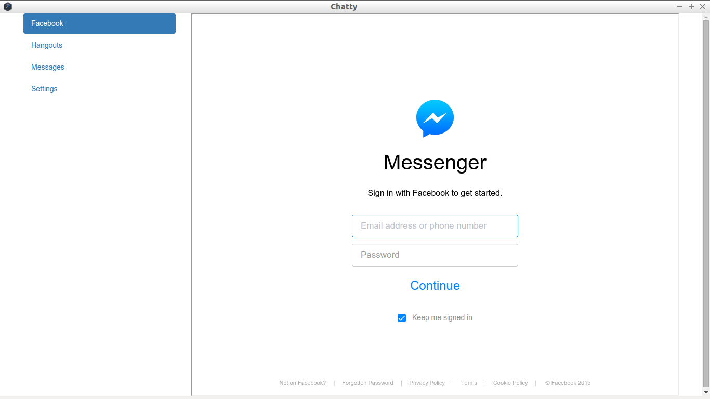
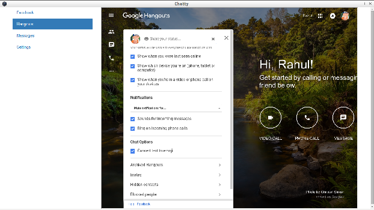

# Chatty
One App to use them All

No more traversing through all your browser tabs to reply to messages.

Chatty is a standalone app built using node-webkit. A dedicated webkit-window, only for messaging . 

Supports:
* Facebook Messenger
* Google Hangouts
* Freenode IRC (webchat.freenode.net)
* Desktop Notifications for the above (Beta)

Chatty is licensed under **MIT License**
